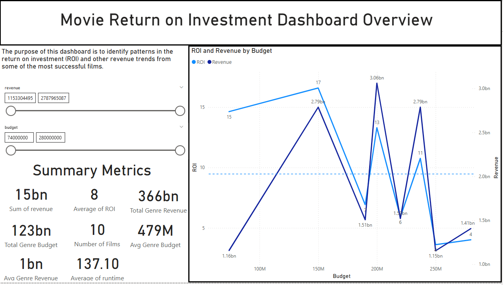
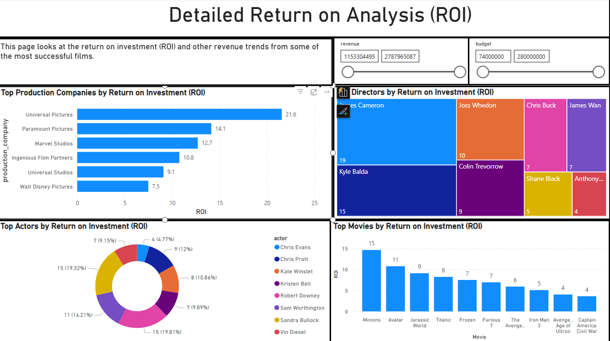
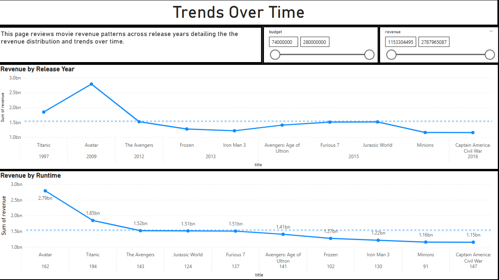
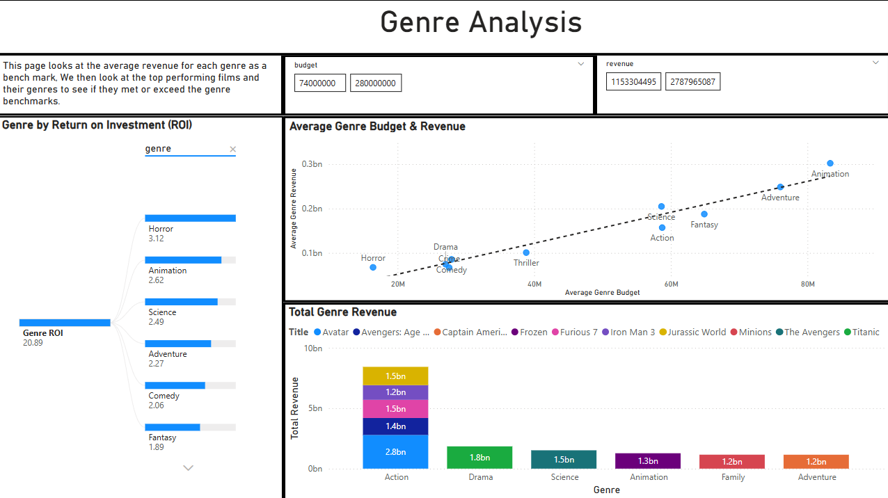
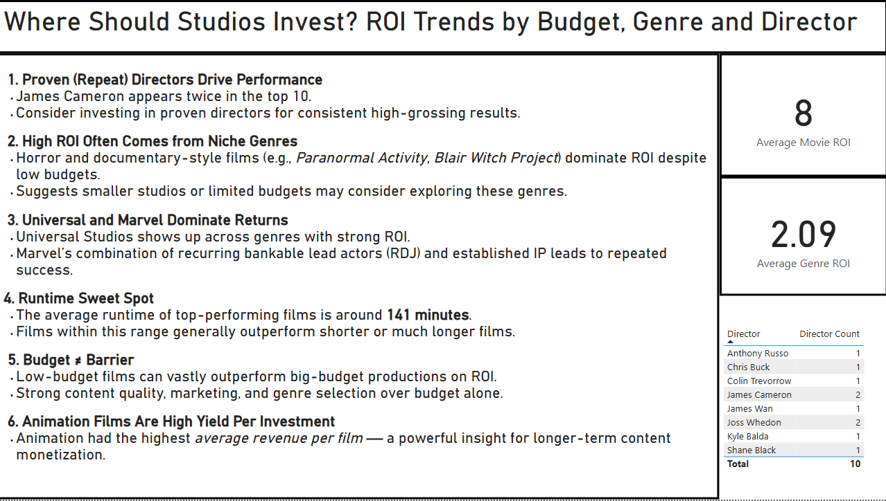

# 🎬 Movie Industry ROI Analysis
Using SQL, Excel, and Power BI to Uncover What Drives Success in the Top ROI-Performing Films

This project analyzes a curated sample of the **top 10 ROI-performing films** (from a dataset of 600+ titles) to uncover what traits drive outstanding financial success. Using SQL, Excel, and Power BI, the goal was to simulate how a customer insights or business analyst might approach a high-level executive request: “What do our most profitable films have in common, and how do we make more of them?”

This project does not attempt to generalize across all films. Instead, it focuses on **repeatable patterns** within the highest performers — to support better decision-making in areas such as content development, casting, budgeting, and production strategy.

---

## Table of Contents

- [Folder Structure](#folder-structure)
- [Business Objective](#business-objective)
- [Key Insights](#key-insights)
- [Data Source](#data-source)
- [Data Preparation Summary](#data-preparation-summary)
- [Dashboard Preview](#dashboard-preview)
- [SQL Questions and Solutions](#sql-questions-and-solutions)
- [Real World Role Alignment](#real-world-role-alignment)
- [Project Progress and Next Steps](#project-progress-and-next-steps)
- [Contact](#contact)
- [Disclaimer](#disclaimer)

---

## Folder Structure

- `sql-queries/` – Contains all SQL queries used to analyze the data
- `images/` – Contains all screenshots used in the README   
- `dashboard.pbix` – Power BI file for interactive exploration  
- `README.md` – Project overview, business questions, and query links

---

## Business Objective

Studios routinely invest millions into film production with no guarantee of return. This project focuses on a **targeted subset of the top 10 ROI performers** from a larger dataset of over 600 films to explore:

- What traits define the most financially successful films?
- Are there repeatable success patterns by genre, director, runtime, or studio?
- Can low-budget films reliably outperform high-budget ones?
- Do certain studios or production approaches consistently yield better results?

This project is framed as if an executive asked:  
> “We’ve had a few huge wins — how do we find more like those?”

It’s built to reflect how an analyst would clean and analyze data, surface actionable findings, and communicate them visually.

---
## Key Insights
The analysis focuses on the **top 10 ROI-performing films** to uncover traits shared by high-reward projects:

- **Proven directors drive performance**  
  James Cameron appears more than once in the top 10, suggesting that investing in repeat, high-performing directors can lead to outsized returns.

- **High ROI comes from niche genres**  
  Horror and documentary-style films (*Paranormal Activity*, *Blair Witch Project*) delivered massive ROI despite modest budgets, highlighting genre leverage as a factor.

- **Universal and Marvel dominate returns**  
  Universal appears frequently in high performers. Marvel’s strategy of recurring IP and bankable lead actors (e.g., RDJ) appears repeatedly in top ROI outcomes.

- **There’s a runtime sweet spot**  
  Top films averaged ~141 minutes. This suggests a performance window where content is rich without overstaying its welcome.

- **Budget is not a barrier**  
  Multiple low-budget films outperformed big-budget projects on ROI — reminding studios that efficiency and content quality can drive value without scale.

- **Animated films yield strong average revenue per title**  
  Animation delivered the highest average revenue per film, hinting at strong monetization potential — even if not top-ranked by ROI.

> These insights reflect trends within the top 10 performers only. They are not intended as generalizations across the full dataset.

---

## Data Source

This project uses a modified version of the publicly available movie dataset from Kaggle:
<https://www.kaggle.com/datasets/utkarshx27/movies-dataset>

The dataset includes information on genre, revenue, budget, production companies, and more.  
It has been cleaned and structured for educational and analytical purposes in this project.

---

##  Data Preparation Summary

- Filled in missing budget and revenue values manually using IMDb and Box Office Mojo 
- Standardized date formats for release year
- Removed entries with 0 revenue and invalid genres
- Normalized genre and production company fields (e.g., cleaned inconsistent naming)
  
---

## Dashboard Preview

1. ### Overview  
  
> High-level summary of movie ROI.

2. ### Detailed ROI Analysis  
  
> Detailed analysis of the ROI of top actors, directors, movies, and production companies.

3. ### Trends Over Time  
  
> Displays movie revenue patterns across release years.

4. ### Genre Analysis  
  
> Compare top-performing films and their genres to average revenues.

5. ### Findings  
  
> Offers findings based on previous pages for potential investors to consider.

[images](/images)

---

## SQL Questions and Solutions

1. [Top 10 Performing Movies](sql-queries/top_movies.sql)  
   Identify the 10 movies with the highest ROI, along with their key contributors.

2. [Budget to Revenue Ratio](sql-queries/budget_ratio.sql)  
   Calculate ROI based on budget-to-revenue for the full dataset.
   
3. [Genre Summary](sql-queries/genre_summary.sql)  
   Analyze total and average revenue/budget by genre.

4. [Compare to Genre Averages](sql-queries/compare_to_avg.sql)  
   Compare each movie’s performance against genre-level averages.

5. [Top Productions by Company](sql-queries/production_companies.sql)  
   Identify studios repeatedly linked to successful movies.

6. [Top 10 Movies vs Average Metrics](sql-queries/avg_vs_actual.sql)  
   Analyze how top-performing movies differ in runtime, budget, and other metrics.

7. [Release Year + Runtime Overview](sql-queries/release_year.sql)  
   Explore how release year and runtime factor into the success of a movie.

---

## Real World Role Alignment
This project simulates the type of work done by analysts in:

- **CX / VoC roles** – extracting patterns from top customer experiences or successful campaigns  
- **Business Analysts** – identifying repeatable success factors to improve investment outcomes  
- **Media / Content Analysts** – advising on production strategy using data-backed insight  

It demonstrates:
- Data preparation, exploration, and querying  
- Communicating nuanced, scoped insights  
- Designing dashboards for decision support, not just visual appeal
---

##  Project Progress and Next Steps

-  Completed SQL analysis with 7 structured queries  
-  Built a Power BI dashboard to visualize trends by genre, director, and studio  
-  Publish a LinkedIn post highlighting key insights and linking to this GitHub project  
-  Learn how to add calculated fields in DAX to enhance ROI and filtering  
-  Optional: Expand dataset to include 2025 movies and streaming/international data for further analysis

---

## Contact

**Aaron Zeug**  
Customer Experience & Reporting Specialist  
Transitioning into Data Analytics with a focus on insight-driven storytelling  
[GitHub Profile](https://github.com/Gray135) • [LinkedIn](https://linkedin.com/in/aaronzeug)

---

## Disclaimer

This project is for educational and portfolio purposes only.  
The analysis is based on publicly available data and reflects exploratory insights only.  
It does not constitute financial, investment, or strategic business advice.  
All interpretations are illustrative and intended to demonstrate technical and analytical skills.  
Any actions taken based on this material are at the user’s own discretion.

